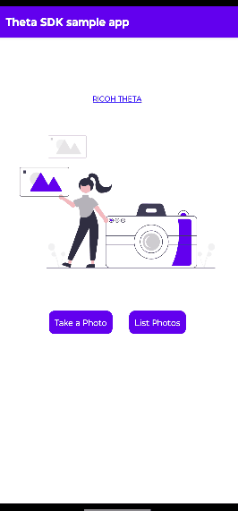
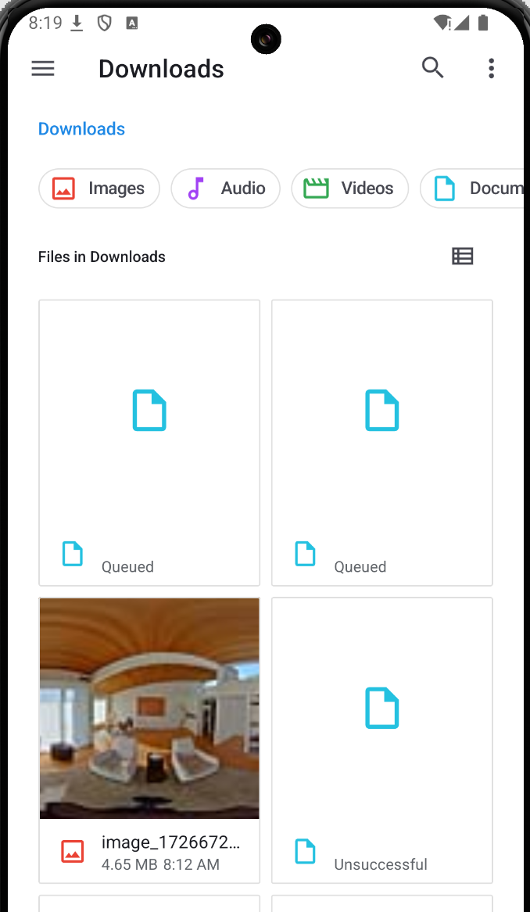
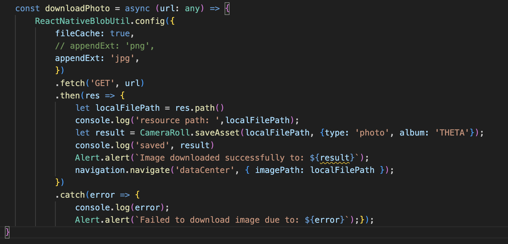
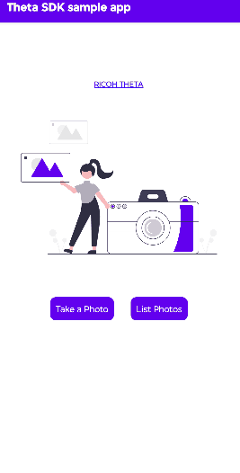

# THETA Client Download Image on Android

This demo showcases the [THETA Client SDK](https://github.com/ricohapi/theta-client) modified with the tutorial linked [here](https://community.theta360.guide/t/download-images-from-url-using-react-native-and-theta-client/9800) to download images on local storage. The tutorial showcased how to download images using a fake THETA API, while this repo uses a physical THETA camera on an Android device. The new files additions and modifications are mainly in the `src` folder inside the `demo-react-native` directory.

## Run Project
* Clone project
* cd into `demos` → `demo-react-native` 
* Run `yarn install --frozen-lockfile` to install the packages

### On Virtual Simulator
* Open Android Studio and select a simulator from the Virtual Device
Manager
* Run `yarn android` to view on the simulator

### On Physical Device
* Navigate into `Settings` → `About Phone` → `Software Information` →
tap `Build Number` seven times to enable USB Debugging. Go into `Settings` → `Developer Options` and ensure USB Debugging is toggled on.
* Plug in device with USB cable. Run `adb devices` and you should see the physical device listed. 
    #### On Mac Set up adb command
    * Run `nano $HOME/.zshrc`
    * Paste the code in
    ```   
        export PATH=$PATH:~/Library/Android/sdk/platform-tools
        export ANDROID_HOME=~/Library/Android/sdk
        export PATH="$HOME/.bin:$PATH"
        export PATH="~/Library/Android/sdk/platform-tools":$PATH  
    ```
    * Run `source ~/.zshrc`
* Run `yarn android`



## Modifications
The tutorial worked well with the fake THETA API, but displayed queued images with a physical THETA camera.  

I added the two packages: [react-native-blob-util](https://github.com/RonRadtke/react-native-blob-util) and [camera-roll](https://www.npmjs.com/package/@react-native-camera-roll/camera-roll) and replaced the download function with the code shown below.



Also, the first time you use the physical camera, reset the camera date settings so it appears in camera roll chronologically (take picture with official RICOH app so it sets time).



    
